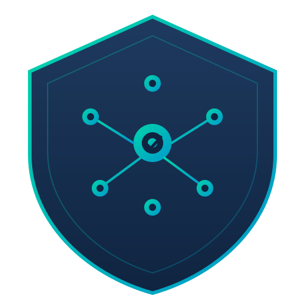

<p align="center">
  
</p>

# Skillid — Org Agent Guardrails Plugin

Policy-driven Claude Code plugin that enforces organization guardrails via skills (guidance) and hooks (enforcement).

## How it works

1. **`policy.yaml`** — single source of truth for all org policies and connector rules
2. **Skills** — loaded into the model's context so it *knows* the rules
3. **Hooks** — fire on every tool call to *enforce* the rules (allow/ask/deny)

```
policy.yaml  →  skills/   (guidance — model sees these)
             →  hooks/    (enforcement — block/confirm/redact)
```

## Quick start

1. Clone this repo into your Claude Code plugins directory:
   ```bash
   # Or add as a plugin from a GitHub repo
   claude /plugin install <org>/skillid
   ```

2. Edit `policy.yaml` with your org's policies (see below)

3. That's it. Hooks fire automatically on tool calls.

## Policy structure

```yaml
org:
  name: "ACME"
  escalation_contact: "security@acme.com"
  audit:
    mode: file              # file | http_post | stdout | none

policy:
  external_comms_require_confirm: true
  destructive_ops_require_confirm: true
  bulk_operation_threshold: 5

connectors:
  atlassian:
    enabled: true
    jira:
      project_modes:
        default: read_write
        overrides:
          LEGAL: blocked      # No access
          SEC: read_only      # Read OK, writes denied
          HR: read_redacted   # Reads return [REDACTED]
      operations:
        allow_create: true
        allow_delete: false
      confirmations:
        before_create: true
```

## Resource modes

| Mode | Reads | Writes | Model sees content? |
|------|-------|--------|---------------------|
| `read_write` | ✅ | ✅ | Yes |
| `read_only` | ✅ | ❌ denied | Yes |
| `read_redacted` | ✅ (redacted) | ❌ denied | PostToolUse attempts replacement; not true isolation |
| `blocked` | ❌ denied | ❌ denied | No |

**Note:** `read_redacted` replaces tool output via PostToolUse. Unless the client guarantees `modifiedOutput` is applied before model exposure, treat it as audit/history cleanup, not true content isolation. For true isolation, use `blocked`.

## Adding a connector

See `skills/adding-connectors/SKILL.md` for the full guide. Summary:

1. Add policy section to `policy.yaml`
2. Create `hooks/connectors/<name>.py` with a resolver class
3. Update `hooks/hooks.json` with tool matchers
4. Add a skill summary at `skills/<name>-policy/SKILL.md`

The agent can do steps 1-4 for you — point it at the MCP server's tool list and it will draft the resolver + policy.

## File structure

```
skillid/
├── .claude-plugin/plugin.json    # Plugin metadata
├── logo.svg                      # Project logo
├── policy.yaml                   # Source of truth — edit this
├── hooks/
│   ├── hooks.json                # Routes tool calls to hook scripts
│   ├── runtime.py                # Shared helper (read events, emit decisions, audit)
│   ├── registry.py               # Connector auto-discovery
│   ├── pre_tool_use.py           # Generic enforcer (all connectors)
│   ├── post_tool_read.py         # Redaction for read_redacted resources
│   └── connectors/
│       ├── atlassian.py          # Atlassian resolver
│       └── <future>.py           # One file per connector
├── skills/
│   ├── org-policy/SKILL.md       # General org guardrails
│   ├── atlassian-policy/SKILL.md # Atlassian-specific rules
│   └── adding-connectors/SKILL.md # Meta-skill: how to add connectors
└── tests/
    └── test_hooks.py             # Unit + integration tests
```

## Audit

Every hook decision emits an audit event. Configure destination in `policy.yaml`:
- `file` — appends JSONL to `~/.skillid/audit.log`
- `http_post` — POSTs JSON to your SIEM endpoint (fire-and-forget)
- `stdout` — writes to stderr (captured by Claude Code)
- `none` — disabled

Audit failures never block policy decisions.

## Design decisions

- **Fail-closed**: unknown tools in a known connector → denied. Unresolvable reads/writes → denied, except explicit list/enumeration operations.
- **Single generic hook**: one `pre_tool_use.py` handles all connectors. No per-tool scripts.
- **Policy as data**: all rules live in YAML, not code. Hook logic is generic.
- **Skills are concise**: kept under 600 tokens. Model gets awareness; hooks do enforcement.
- **PyYAML dependency**: the only non-stdlib dependency. Required on the machine running Claude Code.

## Requirements

- Python 3.10+
- PyYAML (`pip install pyyaml`)
- Claude Code with plugin support
